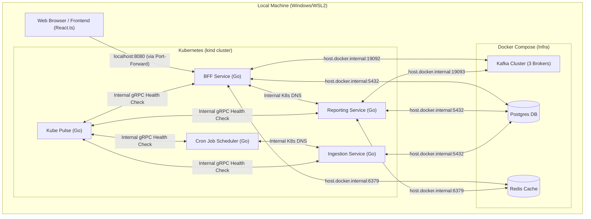
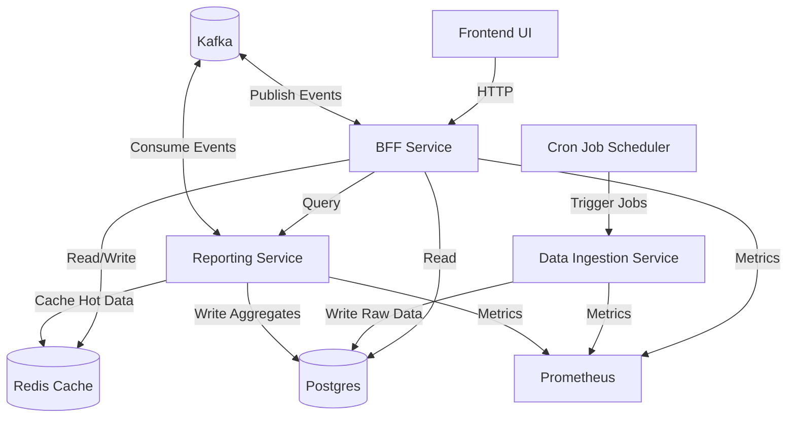
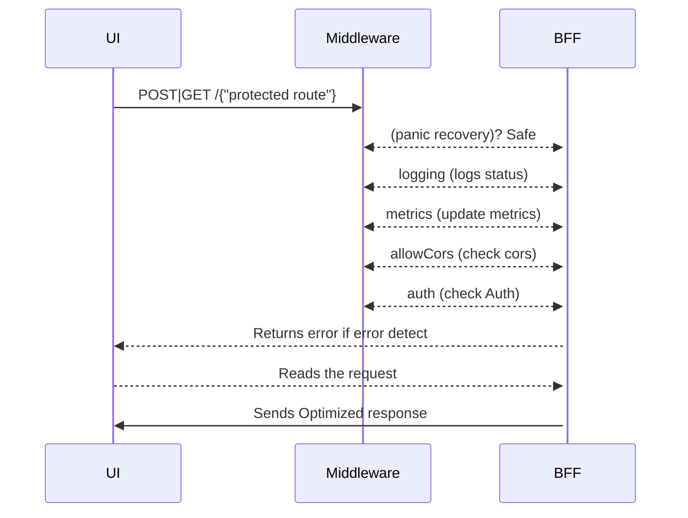
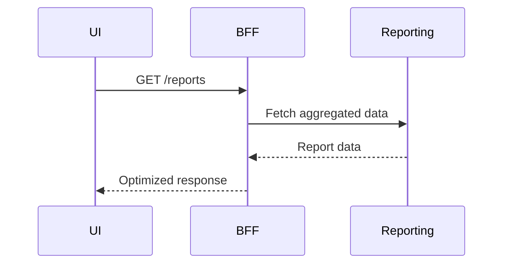
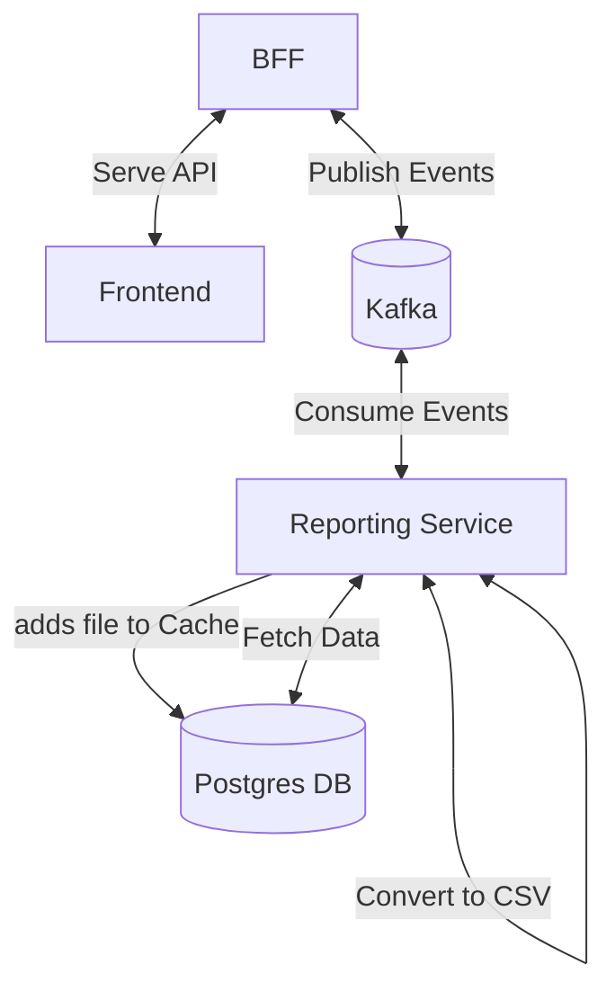
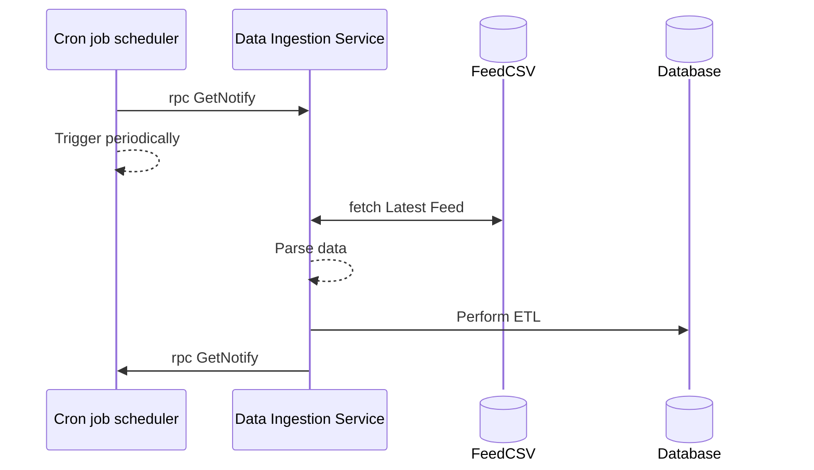

## Nation Pulse

_This project is created for learning purposes, and lack many features which are usually seen in production grade system. This is my attempt to try and build a complete end to end system_

A platform to explore and learn about several countries demographics and economy.
The project technically demonstrates the use of Go programming language and various backend services which can run a simple backend system. My main objective for builing this project involves learning how a simple backend system works, what are the components that make up an end to end runing system. And to start thinking like a gopher!

This documentation provides you with all the details you need to know about this project.

## Index:

- [Overview](#overview)
  - [Features](#features)
  - [Components](#components)
  - [Architecture at a Glance](#architecture-at-a-glance)
  - [Kubernetes architecture](#kubernetes-architecture)
  - [High level Data flow]()
    - [BFF](#bff)
    - [Reporting service](#reporting-using-kafka)
    - [Data ingestion service](#data-ingestion-using-grpc)
    - [Cron job scheduler service](#cron-job-scheduler)
  - [Service to Service Communication](#service-to-service-communication)
  - [API Design](#api-design)
  - [Concurrency & Performance Considerations](#concurrency--performance-considerations)
  - [Reliability & Observability](#reliability--observability)
  - [Failure Scenarios & Handling](#failure-scenarios--handling)
  - [Local Development](#local-development)
  - [Project Structure](#project-structure)
  - [Roadmap / Future Improvements](#roadmap--future-improvements)

## Overview

### Features:

- Dashboard (Show population, health cases and GDP insights)
- Population (Show diverse population metrics of a country)
- Health (Show various health cases and mortality rates of a ountry)
- Economy (Shows GDP, government revenues and import/export metrics)
- Reporting (Generates reports of country's population, health, economy, etc.)
- Permissions (Modify permissions of the user - admin only)

#### As the project is still in development state, new features and components will be added in the future. You can find the roadmap [here](#roadmap--future-improvements)

#### To view the project frontend images. You can find it [here](https://github.com/vinaymanala/NationPulse-Frontend?tab=readme-ov-file#images)

### Components

#### The project consists of mulitple components.

- [BFF](#bff) - The BFF(Backend-for-Frotend) layer is created to aggregate and manage data access for the frontend. It abstracts multiple backend ervices (Reporting, Data Ingestion, Cron job scheduler, etc.) and provides a single point of call from the frontend.
- [Reporting service](#reporting-using-kafka) - The Reporting service is used by the BFF layer for handling of reports requests for the users. It uses kafka as a mesage broker to send and receive message requests from and to the bff layer.
- [Data ingestion service](#data-ingestion-using-grpc) - The Data Ingestion service is used to ingest new feed data periodically from OECD source. The service uses ETL(Extract, Transform and Load) simplified version written in Go to ingest feeds and uploads to the Postgres database.
- [Cron job scheduler service](#cron-job-scheduler) - The Cron Job Scheduler service is used as a trigger for data ingestion service to ingest new feed. It uses a simple cron job library written in Go.
- _[NEW]_ [Kube Pulse](#kube-pulse) - The kube pulse is health check service using gRPC default healthcheck server properties and methods. The service checks all the project services and inside services there is a health check for postgres and redis.

## Architecture at a Glance

### Kubernetes Architecture

A simple kubernetes setup is done locally using kind which provides multi-node fast cluster setup. Using kubectl to manage kubernetes cluster. All the services are running inside pods. Each service has its own deploy.yaml file and the environments variables are added via a infra-config.yaml file. You can find these yaml files in the root folder under `k8s/`.



### High level Flow

A simple high level architecture of how the project backend flows:



Note: Some components are still in development or I have not started.

## High-Level Data Flow

### BFF

A simple Frontend-BFF/Monolith request/response flow



- What the BFF talks to and what does it **not** do?

  The concept of bff layer works a bit different in this project. The initial thought was to create a full microservice architecture where bff would handle only the aggregation, calling other services and transforming data, etc. and each service will handle the authentication, logging, etc. Since developing such things were complex to handle, I gradually started with partial BFF/Monolith module which now multiple services (Dashboard, Population, Health, Economy, Reporting, Permissions, etc.) which are the core features provided by this project in a single repository.

  This bff layer talks to multiple service for data aggregation and authenticates the user on each request. It also provides other middlewares like logging, recovery, track simple metrics, handling permissions, etc. IT does not provide seperate bff layer for different types of clients.

- What is BFF?

  The BFF (Backend-for-Frontend) is a simple layer which sits between your frontend and backend services. It handles your user requests, checks which service to call, and send the response back to the client. We can setup multiple BFF's for specific clients, such as mobile, standalone applications, web applications all can have their own bff layer, adhering to their own requirements and UI behaviour. It should not talk directly to cache, databases as the functionality of BFF is only talk to services and clients. It exists to protect the frontend from backend complexity. It can also handle failures gracefully, and returns frontend-optimized responses. This reduces latency, avoids overfetching, and allows backend services to evolve without breaking the UI.

  #### Core responsiblities
  - Request orchestration across backend services
  - Data tranformation for frontend needs
  - Authentication and request validation
  - Handling Failure recovery, Logging
  - Working as a monolith handling multiple services internally
  - Response caching
  - Database handling

- Where latency can occur ?

  Since bff talks to other downstream services doing network hops (reporting, services, cache, DB) which adds network overhead, so we can expect latency.

- What if a dependency degrades?

  We can handle this gracefully by adding timeouts, partial early responses, error handling and giving isolation to services. Circuit breakers and retries can be introduced here to prevent cascading failures when we are handling a large amount of users and scaling the system

- Why frontend doesn't call services directly?

  This leads to tight coupled system which cannot scale.This can make the system hard to evolve.
  - Frontend would need to know every service endpoint before hand.
  - Frontend would need to handle auth, rate limiting for each service seperately, handling timeouts, data transformation, etc.

  This is the reason we need a bff or similar component which handles all this implementation and making frontend decoupled from scaling backend services.

### Reporting (Using kafka)

A simple flow where BFF and Reporting Service handling the report generation using kafka





- Why a seperate reporting service?

  A service is a small unit of work which is isolated and works as per the business requirement. A reporting service would handle the report generation, data aggregation and may do CPU heavy intensive work. This would have involved handling large historical datasets, making this a read-heavy achitecture. This is more than just a traditional request-response service. A seperate reporting service can perform this work in isolation and scale independently.

- Why use kafka?

  Kafka is used for event streaming, used for producing and consuming messages with high throughput. kafka follows pull based mechanism by consumers, and uses a cluster to orchestrate and distribute the messages to read my their consumer group and partitioned based on the message topic given. It is also widely used in many companies. Handling report generation requests though required such system which can process even delayed messages and notifies the system.

- Kafka vs RabbitMQ

  Kafka
  - Built in high throughput event streaming
  - The messages are stored on disk, data retention
  - Mainly used for event driven architecture, data pipelines.
  - Distributed system scales horizontally
  - Guranteed ordering per partition

  RabbitMQ
  - is a traditional mesage broker
  - Uses ordering inside a queue
  - Pull based mechanism
  - Used for request/response, task queues, background jobs.

  #### Core responsibilities
  - Report generation
  - Handling large datasets
  - Event driven architecture
  - Read heavy load
  - Asynchronous comunication
  - Data transformation

### Data Ingestion (Using gRPC)

A simple flow how cron job scheduling and data ingestion service works togethter



- Why data ingestion ?

  To show latest and updated data was a core idea and requirement for the project. To view a country's demographics and economy, the data should be accurate and should be not stale. This service ingest the new feeds periodically from the source to the postgres database. This is a important step in every business applications to ensure client gets the most latest and accurate data.

- Why gRPC?

  gRPC is a standard and most efficient way for communicating between services. It uses protocol buffers as data serialization and uses the contract definitions to maintain a strictly-typed schema. Its fast because it works over HTTP/2 protocol and transmitted in binary.
  Making an ideal choice for inter-services communication and for my learning purposes.

- What if multiple jobs ran at the same time?

  I am using mutex locking mechanism to make sure no two process starts parallely.

  #### Core responsibilities
  - Data ingestion
  - Write heavy load
  - Data transformation
  - ETL using goroutines and channels
  - Batch processing
  - gRPC serice to service communication

### Cron job scheduler

- Why cron job ?

  Data ingestion process cannot happen on its own. You would need a mechanism which can trigger a process to start its job and notify the main system upon work completion. Such process is called a background job which runs in the background, not visible to clients. You need a triggering service such as a cron job which schedules the job periodically. Ex AWS lambda service is most popular for such needs.
  I used a simple cron job library in go which does what is needed.

- What if multiple jobs ran at the same time?

  The library uses mutex internally to lock the process and making sure only one processis active and running. I haven't gone through the library code and read the main functions from the library required to implement in my project.

  #### Core responsibilities
  - Cron job scheduling
  - gRPC service to service communication
  - Locking mechanism

### Kube Pulse

- Why kube pulse ?

  Any project needs to know whetther their backend services are healthy and running. This project implements a simple health check using gRPC health check provider.
  Every service health check is run inside a goroutine to concurrently check all the services are healthy. The logs are structured which shows the service name and status. There is a health check inside services which are using postgres and redis to check if they are connected. For error checks for each dependency errgroup library is very helpful to check and propagate any first failed dependency error / non-nil error, eventually shutting down the service.

  ### Core responsibilities
  - Health check

## Service-to-Service Communication

- REST vs gRPC

  REST
  - Uses HTTP/1.1
  - Easy integration
  - Data serialization - JSON
  - Uses client-server request/response architecture
  - Easy to debug
  - External facing APIs
  - Widely used as a API protocol between the client and backend

  gRPC
  - Uses HTTP/2
  - Difficult to implement
  - Data serialization - protocol buffers (binary)
  - Strongly typed, contract first
  - Supports bi-directional streaming
  - Uses mainly for backend service to service communication

- Timeouts

  If you want your backend services to recover//backoff on their own when the process its running is either taking too long or the target resource is down. You need a simple mechanism to handle such common issues. Using timeouts is as basic and necessary as adding a HTTP method to your endpoint. You should assign timeouts for every network calls, such as database calls, inter service communicatio, external API calls, etc. In go you can assign timeout with the help of context. The combination of context with timeout can save you from unknown issues which can eventually can brings down you system.

- Circuit-breaking (planned)

  Circuit breakers prevent cascading failures by failing fast when your downstram system are down. It usually combined with timeouts and retries.
  You can uses circuit breakers as a middleware or after the timeout with retries. It has three states, open, close and half open.
  - Open: circuit is open, fail fast
  - Close: circuit is closed, pass the requests.
  - Half open: circuit is half opn, lets send some requests and check

## API Design

The API structure is read heavy and all the REST APIs resides in the BFF layer making it a BFF/Monolith. Though its easy to make the monolith a modular monolith with some configurations. The end goal is to build a complete microservice architecture with BFF decoupled from these services. Since this project is under development, I have not added the api versioning, and its planned.

```
REST APIs

[User service]
POST /api/u/signin - Signing the user
POST /api/u/signout - Signout the user
POST /api/u/token/refresh - createing refresh token

[Utils service]
POST /api/uu/permissions - gets the user permissions
POST /api/uu/reports/publish - report generation
GET /api/uu/reports/subscribe/event - SSE client call

[Dashboard service]
GET /api/dashboard/population - gets the top population data
GET /api/dashboard/health - gets the top health related cases data
GET /api/dashboard/gdp - gets the top gdp data

[Population service]
GET /api/population/country - gets the country's population data

[Health service]
GET /api/health/country - gets the country's health cases data

[Economy service]
GET /api/economy/governmentdata/country - gets the country's government data
GET /api/economy/gdp/country - gets the country's gdp data

[Growth service]
GET /api/growth/gdp/country - gets the country's gdp data
GET /api/growth/population/country - gets the country's population data

gRPC

[Data ingestion service]
// Unary RPC - notifies the BFF layer upon process completes
rpc NotifyBFF(NotifyBFFRequest) returns ( stream NotifyBFFResponse);

```

## Concurrency & Performance Considerations

As Rob Pike said -

> "Concurrency is the composition of independently executing computations.
> Its not parallelism. A concurrent program can run in parallel using multi-processor if well written"

- Goroutines for parallel service calls

  A goroutine is a light weight user level thread which is fast and efficient can orchestrated by Go runtime and scheduled on top of OS threads. They can start as small as 2KB. You can have millions of goroutines runnign at an instance.

  I have used goroutines in reporting service for running kakka producer and consumer as both are blocking calls. Used goroutines and error channels in data ingestion to run my ETL function concurrently and using error channels at each stage.

- Context propagation and Timeouts

  The context is been used at every calls made from bff and other backend services.ontext propagation and timeouts ensure that long-running or stuck goroutines are cancelled early, preventing resource leaks and improving system stability.

## Reliability & Observability

- Logging
  Used zap logger, fast logging setup as a middleware. Requests, boundaries, failures, and slow paths. The log consists of http path, query, statusCode, latency occured, http method and userAgent headers. Logging is very necessary to debug any unknown issues, logging any network failures, and latency issues.

- Metrics (Prometheus planned/added)

  Integrated prometheus to detect and record simple http response and count metrics. As this is new to me, I will add more metrics and learn more about metrics handling and health checks.

- Tracing (future)

  Tracing provides end-to-end visibility of a request as it flows across services, helping identify latency bottlenecks and failure points. I have yet to add this and learn about this tool.

## Failure Scenarios & Handling

- Reporting service timeout - partial response with degraded data
- Cache miss - fallback to database
- Downstream failure - fast failure with meaningful error
- kafka - log from writer and reader

## Local Development

To run the project locally, make sure you have Docker installed, `kind` and `kubectl` for running kubernetes cluster . You would also need make command to run the setup and few other things.

At the project root folder, run this command in your terminal:

First time running the project:

```
make setup
```

If you did some changes in Go code(optional):

```
make build
make load
make restart
```

Start running the project:

```
make up
make tunnel
```

`make up`command will start kafka, postgres, redis and prometheus instances.

To stop the setup completely

```
make clean
```

You need to add the backup.sql file into your postgres database instance.

That's it! You have now backend up and running. If still there are issues. Just let me or Google/AI know. They can help definitely

if you want to stop all the instances running, run this command in your terminal:

```
make down
```

To run the full project using docker. You need to change the host mappings to localhost from docker host.
After changes are done correctly, run this command:

```
make start
```

##### To run the project frontend , you can follow the instructions from [here](https://github.com/vinaymanala/NationPulse-Frontend)

## Project Structure

Below is the project structure. It is not the best way to create such structure, I have tried to create a microservice but a feature based project structure. You can follow other repository with provides you with boilerplate go code with microservices architecture.

```
├── k8s/
│   ├── infra-config.yaml
│   ├── kubepulse-deploy.yaml
│   ├── nationpulse-bff-deploy.yaml
│   ├── nationpulse-cronjob-deploy.yaml
│   ├── nationpulse-ingestion-deploy.yaml
│   └── nationpulse-reporting-deploy.yaml
├── kubepulse/
│   ├── cmd/
│   │   └── main.go
│   ├── internal/
│   │   └── checkhealth.go
│   ├── Dockerfile
│   ├── go.mod
│   └── go.sum
├── nationpulse-bff/
│   ├── cmd/
│   │   └── main.go
│   ├── internal/
│   │   ├── auth/
│   │   │   └── auth.go
│   │   ├── config/
│   │   │   └── config.go
│   │   ├── handlers/
│   │   │   ├── admin.go
│   │   │   ├── dashboard.go
│   │   │   ├── economy.go
│   │   │   ├── growth.go
│   │   │   ├── health.go
│   │   │   ├── population.go
│   │   │   ├── user.go
│   │   │   └── utils.go
│   │   ├── kafka/
│   │   │   └── kafkaSvc.go
│   │   ├── middlewares/
│   │   │   └── middleware.go
│   │   ├── repos/
│   │   │   ├── admin.go
│   │   │   ├── dashboard.go
│   │   │   ├── economy.go
│   │   │   ├── growth.go
│   │   │   ├── health.go
│   │   │   ├── population.go
│   │   │   ├── user.go
│   │   │   └── utils.go
│   │   ├── server/
│   │   │   ├── routes.go
│   │   │   └── server.go
│   │   ├── services/
│   │   │   ├── admin.go
│   │   │   ├── dashboard.go
│   │   │   ├── economy.go
│   │   │   ├── growth.go
│   │   │   ├── health.go
│   │   │   ├── population.go
│   │   │   ├── user.go
│   │   │   └── utils.go
│   │   ├── store/
│   │   │   ├── pgsql.go
│   │   │   └── redis.go
│   │   └── utils/
│   │       ├── constants.go
│   │       ├── types.go
│   │       └── utils.go
│   ├── .gitignore
│   ├── docker-compose.yml
│   ├── Dockerfile
│   ├── go.mod
│   ├── go.sum
│   ├── LICENSE
│   ├── Makefile
│   ├── prometheus.yml
│   └── README.md
├── nationpulse-cron-data-ingestion-schedular-svc/
│   ├── cmd/
│   │   └── main.go
│   ├── internal/
│   │   ├── client/
│   │   │   └── grpc-client.go
│   │   ├── config/
│   │   │   └── config.go
│   │   └── scheduler/
│   │       └── scheduler.go
│   ├── pb/
│   │   ├── data-ingestion_grpc.pb.go
│   │   └── data-ingestion.pb.go
│   ├── .gitignore
│   ├── data-ingestion.proto
│   ├── Dockerfile
│   ├── go.mod
│   ├── go.sum
│   ├── Makefile
│   └── PASTEBIN.md
├── nationpulse-data-ingestion-svc/
│   ├── cmd/
│   │   └── main.go
│   ├── internal/
│   │   ├── config/
│   │   │   └── config.go
│   │   ├── service/
│   │   │   ├── constants.go
│   │   │   ├── data-ingestion.go
│   │   │   ├── service_test.go
│   │   │   ├── types.go
│   │   │   └── utils.go
│   │   ├── store/
│   │   │   └── pgsql.go
│   │   └── types/
│   │       └── types.go
│   ├── pb/
│   │   ├── data-ingestion_grpc.pb.go
│   │   └── data-ingestion.pb.go
│   ├── .gitignore
│   ├── data-ingestion.proto
│   ├── Dockerfile
│   ├── go.mod
│   ├── go.sum
│   ├── Makefile
│   └── README.md
├── nationpulse-reporting-svc/
│   ├── cmd/
│   │   └── main.go
│   ├── internal/
│   │   ├── config/
│   │   │   └── config.go
│   │   ├── csvSvc/
│   │   │   ├── generator.go
│   │   │   └── types.go
│   │   ├── kafkaSvc/
│   │   │   ├── consumer.go
│   │   │   └── producer.go
│   │   ├── service/
│   │   │   ├── export.go
│   │   │   └── utils.go
│   │   ├── store/
│   │   │   ├── pgsql.go
│   │   │   ├── redis.go
│   │   │   └── types.go
│   │   ├── types/
│   │   │   └── types.go
│   │   ├── kafka.go
│   │   ├── test-jsontocsv.go
│   │   └── test-kafka.go
│   ├── .dockerignore
│   ├── .gitignore
│   ├── docker-compose.yml
│   ├── Dockerfile
│   ├── go.mod
│   ├── go.sum
│   ├── Makefile
│   └── README.md
├── .gitignore
├── docker-compose.yml
├── LICENSE
├── Makefile
├── PASTEBIN.md
├── prometheus.yml
└── README.md

```

You can generate your own tree like structure [here](https://githubtree.mgks.dev/)

## Roadmap / Future Improvements

- Add AI orchestration for dashboard and chart data insights
- Add circuit breakers and retries
- Kubernetes complete architecture
- Distributed tracing with OpenTelemetry
- End to end microservice architecture
- Health checks and metrics aggregator with Prometheus and Grafana
- More OECD and other data sources insights
