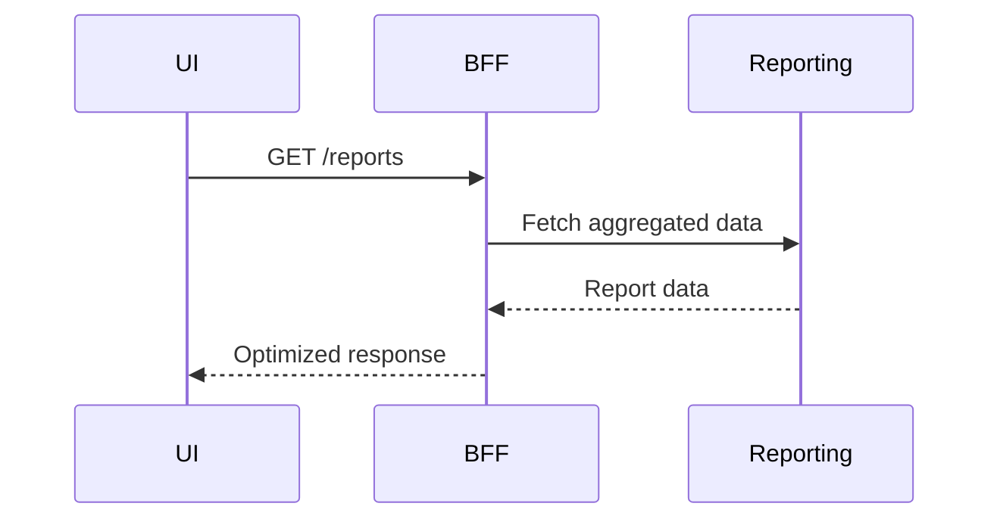

## Nation Pulse

A platform to explore and learn about several countries demographics and economy.
The project technically demonstrates the use of Go programming language and various backend services which can run a simple backend system. My main objective for builing this project involves learning how a simple backend system works, what are the components that make up an end to end runing system. And to start thinking like a gopher!

This documentation provides you with all the details you need to know about this project.

## Index:

## Overview

### Features:

- Dashboard (Show population, health cases and GDP insights)
- Population (Show diverse population metrics of a country)
- Health (Show various health cases and mortality rates of a ountry)
- Economy (Shows GDP, government revenues and import/export metrics)
- Reporting (Generates reports of country's population, health, economy, etc.)

#### As the project is still in development state, new features and components will be added in the future. You can find the roadmap [here](#roadmap--future-improvements)

### Components

#### The project consists of mulitple components.

- [BFF](#bff) - The BFF(Backend-for-Frotend) layer is created to aggregate and manage data access for the frontend. It abstracts multiple backend services (Reporting, Data Ingestion, Cron job scheduler, etc.) and provides a single point of call from the frontend.
- [Reporting service](#reporting-using-kafka) - The Reporting service is used by the BFF layer for handling of reports requests for the users. It uses kafka as a mesage broker to send and receive message requests from and to the bff layer.
- [Data ingestion service](#data-ingestion-using-grpc) - The Data Ingestion service is used to ingest new feed data periodically from OECD source. The service uses ETL(Extract, Transform and Load) simplified version written in Go to ingest feeds and uploads to the Postgres database.
- [Cron job scheduler service](#cron-job-scheduler) - The Cron Job Scheduler service is used as a trigger for data ingestion service to ingest new feed. It uses a simple cron job library written in Go.

## Architecture at a Glance

## High-Level Data Flow

### BFF

- What the BFF talks to and what does it **not** do?

  The concept of bff layer works a bit different in this project. The initial thought was to create a full microservice architecture where bff would handle only the aggregation, calling other services and transforming data, etc. and each service will handle the authentication, logging, etc. Since developing such things were complex to handle, I gradually started with partial BFF/Monolith module which now multiple services (Dashboard, Population, Health, Economy, Reporting, Permissions, etc.) which are the core features provided by this project in a single repository.

  This bff layer talks to multiple service for data aggregation and authenticates the user on each request. It also provides other middlewares like logging, recovery, track simple metrics, handling permissions, etc. IT does not provide seperate bff layer for different types of clients.

- What is BFF?

  The BFF (Backend-for-Frontend) is a simple layer which sits between your frontend and backend services. It handles your user requests, checks which service to call, and send the response back to the client. We can setup multiple BFF's for specific clients, such as mobile, standalone applications, web applications all can have their own bff layer, adhering to their own requirements and UI behaviour. It should not talk directly to cache, databases as the functionality of BFF is only talk to services and clients. It exists to protect the frontend from backend complexity. It can also handle failures gracefully, and returns frontend-optimized responses. This reduces latency, avoids overfetching, and allows backend services to evolve without breaking the UI.

  #### Core responsiblities
  - Request orchestration across backend services
  - Data tranformation for frontend needs
  - Authentication and request validation
  - Handling Failure recovery, Logging
  - Working as a monolith handling multiple services internally
  - Response caching
  - Database handling



- Where latency can occur ?

  Since bff talks to other downstream services doing network hops (reporting, services, cache, DB) which adds network overhead, so we can expect latency.

- What if a dependency degrades?

  We can handle this gracefully by adding timeouts, partial early responses, error handling and giving isolation to services. Circuit breakers and retries can be introduced here to prevent cascading failures when we are handling a large amount of users and scaling the system

- Why frontend doesn't call services directly?

  This leads to tight coupled system which cannot scale.This can make the system hard to evolve.
  - Frontend would need to know every service endpoint before hand.
  - Frontend would need to handle auth, rate limiting for each service seperately, handling timeouts, data transformation, etc.

  This is the reason we need a bff or similar component which handles all this implementation and making frontend decoupled from scaling backend services.

### Reporting (Using kafka)

- Why a seperate reporting service?

  A service is a small unit of work which is isolated and works as per the business requirement. A reporting service would handle the report generation, data aggregation and may do CPU heavy intensive work. This would have involved handling large historical datasets, making this a read-heavy achitecture. This is more than just a traditional request-response service. A seperate reporting service can perform this work in isolation and scale independently.

- Why use kafka?
- Kafka vs RabbitMQ?

  #### Core responsibilities
  - Report generation
  - Handling large datasets
  - Event driven architecture
  - Read heavy load
  - Asynchronous comunication
  - Data transformation

### Data Ingestion (Using gRPC)

- Why data ingestion ?
  To show latest and updated data was a core idea and requirement for the project. To view a country's demographics and economy, the data should be accurate and should be not stale. This service ingest the new feeds periodically from the source to the postgres database. This is a important step in every business applications to ensure client gets the most latest and accurate data.

- Why gRPC?
  gRPC is a standard and most efficient way for communicating between services. It uses protocol buffers as data serialization and uses the contract definitions to maintain a strictly-typed schema. Its fast because it works over HTTP/2 protocol and transmitted in binary.
  Making an ideal choice for inter-services communication and for my learning purposes.

- What if multiple jobs ran at the same time?

  I am using mutex locking mechanism to make sure no two process starts parallely.

  #### Core responsibilities
  - Data ingestion
  - Write heavy load
  - Data transformation
  - ETL using goroutines and channels
  - Batch processing
  - gRPC serice to service communication

### Cron job scheduler

- Why cron job ?

  Data ingestion process cannot happen on its own. You would need a mechanism which can trigger a process to start its job and notify the main system upon work completion. Such process is called a background job which runs in the background, not visible to clients. You need a triggering service such as a cron job which schedules the job periodically. Ex AWS lambda service is most popular for such needs.
  I used a simple cron job library in go which does what is needed.

- What if multiple jobs ran at the same time?

  The library uses mutex internally to lock the process and making sure only one processis active and running. I haven't gone through the library code and read the main functions from the library required to implement in my project.

  #### Core responsiblities
  - Cron job scheduling
  - gRPC service to service communication
  - Locking mechanism

## Service-to-Service Communication

- REST vs GRPC
- Timeouts
- Circuit-breaking (planned)

## API Design

## Concurrency & Performance Considerations

- Goroutines for parallel service calls
- Context propagation
- Timeouts

## Reliability & Observability

- Logging strategy
- Metrics (Prometheus planned/added)
- Tracing (future)

## Failure Scenarios & Handling

- Reporting service timeout → partial response with degraded data
- Cache miss → fallback to database
- Downstream failure → fast failure with meaningful error

## Local Development

To run the project locally, make sure you have Docker installed and running. You would also need make command to run the setup and few other things.

At the project root folder, run this command in your terminal:

```
make start
```

This command will start bff, reporting, ingestion, cronjob, kafka, postgres, redis and prometheus instances.

You need to add the backup.sql file into your postgres database instance.

That's it! You have now backend up and running. If still there are issues. Just let me or Google/AI know. They can help definitely

if you want to stop all the instances running, run this command in your terminal:

```
make stop
```

## Project Structure

Below is the project structure. It is not the best way to create such structure, I have tried to create a microservice but a feature based project structure. You can follow other repository with provides you with boilerplate go code with microservices architecture.

```
├── nationpulse-bff/
│   ├── cmd/
│   │   └── main.go
│   ├── internal/
│   │   ├── auth/
│   │   │   └── auth.go
│   │   ├── config/
│   │   │   └── config.go
│   │   ├── handlers/
│   │   │   ├── admin.go
│   │   │   ├── dashboard.go
│   │   │   ├── economy.go
│   │   │   ├── growth.go
│   │   │   ├── health.go
│   │   │   ├── population.go
│   │   │   ├── user.go
│   │   │   └── utils.go
│   │   ├── kafka/
│   │   │   └── kafkaSvc.go
│   │   ├── middlewares/
│   │   │   └── middleware.go
│   │   ├── repos/
│   │   │   ├── admin.go
│   │   │   ├── dashboard.go
│   │   │   ├── economy.go
│   │   │   ├── growth.go
│   │   │   ├── health.go
│   │   │   ├── population.go
│   │   │   ├── user.go
│   │   │   └── utils.go
│   │   ├── server/
│   │   │   ├── routes.go
│   │   │   └── server.go
│   │   ├── services/
│   │   │   ├── admin.go
│   │   │   ├── dashboard.go
│   │   │   ├── economy.go
│   │   │   ├── growth.go
│   │   │   ├── health.go
│   │   │   ├── population.go
│   │   │   ├── user.go
│   │   │   └── utils.go
│   │   ├── store/
│   │   │   ├── pgsql.go
│   │   │   └── redis.go
│   │   └── utils/
│   │       ├── constants.go
│   │       ├── types.go
│   │       └── utils.go
│   ├── .gitignore
│   ├── docker-compose.yml
│   ├── Dockerfile
│   ├── go.mod
│   ├── go.sum
│   ├── LICENSE
│   ├── Makefile
│   ├── prometheus.yml
│   └── README.md
├── nationpulse-cron-data-ingestion-schedular-svc/
│   ├── cmd/
│   │   └── main.go
│   ├── internal/
│   │   ├── client/
│   │   │   └── grpc-client.go
│   │   ├── config/
│   │   │   └── config.go
│   │   └── scheduler/
│   │       └── scheduler.go
│   ├── pb/
│   │   ├── data-ingestion_grpc.pb.go
│   │   └── data-ingestion.pb.go
│   ├── .gitignore
│   ├── data-ingestion.proto
│   ├── Dockerfile
│   ├── go.mod
│   ├── go.sum
│   ├── Makefile
│   └── PASTEBIN.md
├── nationpulse-data-ingestion-svc/
│   ├── cmd/
│   │   └── main.go
│   ├── internal/
│   │   ├── config/
│   │   │   └── config.go
│   │   ├── service/
│   │   │   ├── constants.go
│   │   │   ├── data-ingestion.go
│   │   │   ├── service_test.go
│   │   │   ├── types.go
│   │   │   └── utils.go
│   │   ├── store/
│   │   │   └── pgsql.go
│   │   └── types/
│   │       └── types.go
│   ├── pb/
│   │   ├── data-ingestion_grpc.pb.go
│   │   └── data-ingestion.pb.go
│   ├── .gitignore
│   ├── data-ingestion.proto
│   ├── Dockerfile
│   ├── go.mod
│   ├── go.sum
│   ├── Makefile
│   └── README.md
├── nationpulse-reporting-svc/
│   ├── cmd/
│   │   └── main.go
│   ├── internal/
│   │   ├── config/
│   │   │   └── config.go
│   │   ├── csvSvc/
│   │   │   ├── generator.go
│   │   │   └── types.go
│   │   ├── kafkaSvc/
│   │   │   ├── consumer.go
│   │   │   └── producer.go
│   │   ├── service/
│   │   │   ├── export.go
│   │   │   └── utils.go
│   │   ├── store/
│   │   │   ├── pgsql.go
│   │   │   ├── redis.go
│   │   │   └── types.go
│   │   ├── types/
│   │   │   └── types.go
│   │   ├── kafka.go
│   │   ├── test-jsontocsv.go
│   │   └── test-kafka.go
│   ├── .dockerignore
│   ├── .gitignore
│   ├── docker-compose.yml
│   ├── Dockerfile
│   ├── go.mod
│   ├── go.sum
│   ├── Makefile
│   └── README.md
├── .gitignore
├── docker-compose.yml
├── LICENSE
├── Makefile
├── PASTEBIN.md
├── prometheus.yml
└── README.md
```

You can generate your own tree like structure [here](https://githubtree.mgks.dev/)

## Roadmap / Future Improvements

- Add circuit breakers and retries
- Kubernetes CronJobs for ingestion triggers
- Distributed tracing with OpenTelemetry

The project contains two sub folders:

- [Frontend](https://github.com/vinaymanala/NationPulse-Frontend)
- [Backend](https://github.com/vinaymanala/NationPulse-Backend)
- [README](.)

Please await for further project description and features..
